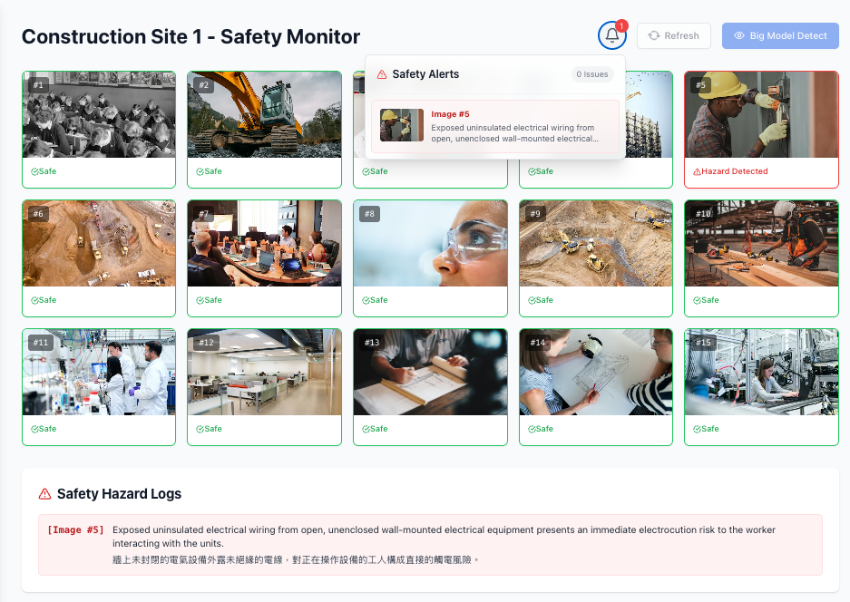
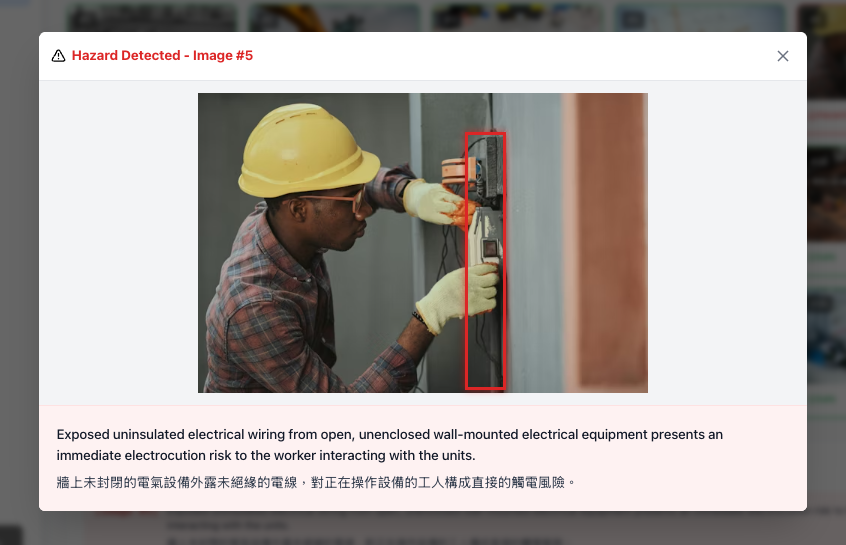

# 建筑工地安全巡检系统

## 功能说明

- 提供建筑工地图片安全隐患识别 Web 界面
- 批量加载现场图片并并发发起大模型检测
- 展示安全隐患统计、告警列表、详细原因与风险框选区域
- 通过后端统一调用大模型服务，避免前端暴露密钥
- 所有运行参数（模型、API Key、thinking、每页图片数）统一在 `config.yaml` 中管理

## 界面截图

**图片网格与安全检测**



**告警详情与风险框选**



## 系统架构

```
┌──────────────────────────┐       ┌──────────────────┐       ┌──────────────────┐
│  Jinja2 + Vanilla JS     │──────▶│  FastAPI + Uvicorn│──────▶│  BytePlus Ark    │
│  Tailwind CDN (浏览器)    │◀──────│   后端 (3001)      │◀──────│  大模型 API       │
└──────────────────────────┘       └──────────────────┘       └──────────────────┘
         │                                   │
         │    /api/config                    │   config.yaml
         │◀──────────────────────────────────│◀──┘
         │    /api/analyze                   │
         │──────────────────────────────────▶│
```

- **前端**：Jinja2 模板 + Vanilla JavaScript + Tailwind CSS（CDN）
- **后端**：Python + FastAPI + Uvicorn
- **大模型**：BytePlus Ark Chat Completions API（`seed-2-0-lite-260228`）
- **配置中心**：`config.yaml`

请求流程：

1. 浏览器访问 `/`，FastAPI 通过 Jinja2 渲染页面
2. 前端从 `/api/config` 读取每页图片数量等运行参数
3. 前端发起 `/api/analyze` 请求，传入图片 URL
4. 后端从 `config.yaml` 读取 API Key、模型、thinking 配置
5. 后端调用大模型接口并解析返回结果
6. 前端展示检测状态、告警内容和统计信息

## 项目结构

```
├── api/                        # Python 后端
│   ├── __init__.py
│   ├── main.py                 # FastAPI 应用入口（模板渲染、静态文件、路由）
│   ├── config.py               # 配置读取模块（读取 config.yaml）
│   └── routes/
│       ├── __init__.py
│       └── analyze.py          # 图片安全分析路由（大模型调用）
├── templates/
│   └── index.html              # Jinja2 页面模板
├── static/
│   ├── css/
│   │   └── app.css             # 自定义样式（动画、工具类）
│   ├── data/
│   │   └── images.json         # 图片 URL 列表
│   └── js/
│       └── app.js              # 前端交互逻辑（Vanilla JS）
├── config.yaml                 # 运行配置（模型、API Key、页面参数）
├── requirements.txt            # Python 依赖
├── .gitignore
├── README.md                   # 简体中文说明
└── README.en.md                # 英文说明
```

## 使用说明

### 1. 安装依赖

```bash
pip install -r requirements.txt
```

### 2. 配置 config.yaml

所有运行参数统一在 `config.yaml` 中设定，包括 API Key：

```yaml
app:
  name: Construction Safety Monitor
  version: 1.0.0

llm:
  provider: BytePlus Ark
  apiUrl: https://ark.ap-southeast.bytepluses.com/api/v3/chat/completions
  apiKey: your_api_key_here
  model: seed-2-0-lite-260228
  thinking:
    level: basic
    type: enabled

ui:
  imagePageSize: 15
```

字段说明：

| 字段 | 说明 |
|------|------|
| `llm.apiKey` | 大模型鉴权密钥（从 https://console.byteplus.com/ark 获取） |
| `llm.apiUrl` | 大模型接口地址 |
| `llm.model` | 调用的模型 ID |
| `llm.thinking.level` | 项目侧 thinking 档位标识 |
| `llm.thinking.type` | 实际发送给 API 的 thinking 模式（`enabled`/`disabled`/`auto`） |
| `ui.imagePageSize` | 前端每页展示图片数量 |

### 3. 启动服务

```bash
python3 -m uvicorn api.main:app --reload --port 3001
```

启动后访问 http://localhost:3001 即可使用。

## 图片数据源说明

当前项目使用 `static/data/images.json` 预置了一组待检测的建筑工地图片 URL，仅用于演示和开发测试。

实际生产场景中，需要将静态图片替换为实时数据源，例如：

- **CCTV 视频流接入**：对接工地监控摄像头的 RTSP / RTMP 视频流，实时获取画面
- **视频抽帧**：对视频流按固定间隔（如每 5 秒）截取帧图片，送入大模型进行安全检测
- **其他图像源**：对接无人机航拍、移动端拍照上传等渠道

替换方式：修改前端 `static/js/app.js` 中的图片加载逻辑，将 `fetchImages()` 从读取本地 JSON 改为调用后端接口获取实时帧图片即可。

## 配置规则

- 所有 API Key / AK / SK / Token 仅在 `config.yaml` 中设定，代码文件通过配置模块引用
- 业务代码不得硬编码任何密钥、模型 ID 或页面数量
- 更换模型或调整参数只需修改 `config.yaml`，无需改动业务代码
- `config.yaml` 不应提交到公开仓库（已在 `.gitignore` 中排除）

## 开源规则

- Copyright (c) 2026 Alex Wang
- Author: Alex Wang
- GitHub: <https://github.com/wanglongxiao>
- Contact: <https://www.linkedin.com/in/alexwanglx/>
- 允许学习、二次开发和内部使用
- 保留原始版权、作者和联系信息
- 任何派生版本都不应移除源码中的版权头注释
- 密钥、令牌和私密配置不得提交到公开仓库

## 版本策略

- 当前版本：`1.0.0`
- 仅在重大功能更新时提升版本号
